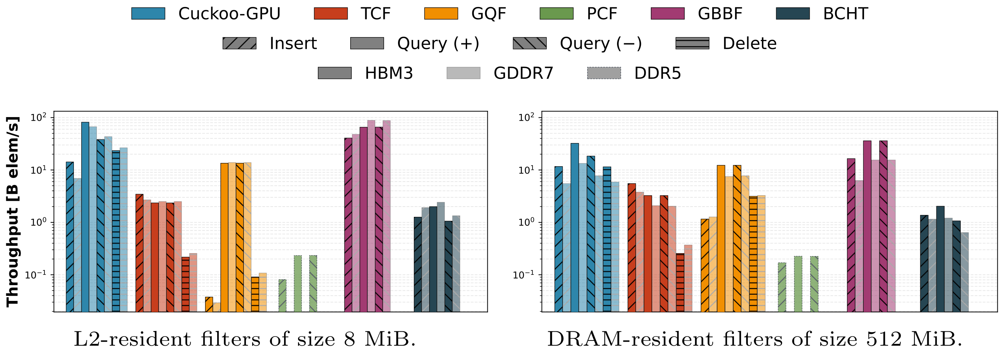

# Cuckoo-GPU

[](https://tdortman.github.io/Cuckoo-GPU/)
[](https://arxiv.org/abs/2603.15486)

A high-performance, lock-free CUDA implementation of the Cuckoo Filter. This library is the companion code for the paper **"Cuckoo-GPU: Accelerating Cuckoo Filters on Modern GPUs"**.

## Overview

This library provides a GPU-accelerated Cuckoo Filter implementation optimized for high-throughput batch operations. Cuckoo Filters are space-efficient probabilistic data structures that support insertion, lookup, and deletion operations with a configurable false positive rate.

## Features

- CUDA-accelerated batch insert, lookup, and delete operations
- Configurable fingerprint size and bucket size
- Multiple eviction policies (DFS, BFS)
- Sorted insertion mode for improved memory coalescing
- Multi-GPU support via [gossip](https://github.com/Funatiq/gossip)
- Experimental IPC support for cross-process filter sharing
- Header-only library design

## Performance



Benchmarks at 95% load factor on an NVIDIA GH200 (H100 HBM3, 3.4 TB/s) with 16-bit fingerprints and equivalent space allocation for the Blocked Bloom Filter. The PCF runs on an Intel Xeon W9-3595X CPU (120 threads).

Cuckoo-GPU is compared against:

- [CPU Partitioned Cuckoo Filter (PCF)](https://github.com/tum-db/partitioned-filters)
- [GPU Bulk Two-Choice Filter (TCF)](https://github.com/saltsystemslab/gpu-filters/tree/main/bulk-tcf)
- [GPU Counting Quotient Filter (GQF)](https://github.com/saltsystemslab/gpu-filters/tree/main/gqf)
- [GPU Blocked Bloom Filter (GBBF)](https://github.com/NVIDIA/cuCollections)
- [GPU Bucketed Cuckoo Hash Table (BCHT)](https://github.com/owensgroup/BGHT)

### L2-Resident (4M items, ~8 MiB)

| Comparison         | Insert         | Query        | Delete      | FPR              |
| ------------------ | -------------- | ------------ | ----------- | ---------------- |
| Cuckoo-GPU vs PCF  | 175× faster    | 351× faster  | N/A         | 0.046% vs 0.011% |
| Cuckoo-GPU vs TCF  | 4× faster      | 35× faster   | 108× faster | 0.046% vs 0.409% |
| Cuckoo-GPU vs GQF  | 378× faster    | 6× faster    | 258× faster | 0.046% vs 0.001% |
| Cuckoo-GPU vs GBBF | 0.35× (slower) | 1.2× faster  | N/A         | 0.046% vs 2.503% |
| Cuckoo-GPU vs BCHT | 11.3× faster   | 40.9× faster | N/A         | 0.046% vs 0%     |

### DRAM-Resident (268M items, ~512 MiB)

| Comparison         | Insert        | Query         | Delete       | FPR              |
| ------------------ | ------------- | ------------- | ------------ | ---------------- |
| Cuckoo-GPU vs PCF  | 69× faster    | 143× faster   | N/A          | 0.044% vs 0.010% |
| Cuckoo-GPU vs TCF  | 2.1× faster   | 9.9× faster   | 44.9× faster | 0.044% vs 0.467% |
| Cuckoo-GPU vs GQF  | 10.1× faster  | 2.6× faster   | 3.6× faster  | 0.044% vs 0.001% |
| Cuckoo-GPU vs GBBF | 0.7× (slower) | 0.9× (slower) | N/A          | 0.044% vs 6.092% |
| Cuckoo-GPU vs BCHT | 8.5× faster   | 15.9× faster  | N/A          | 0.044% vs 0%     |

> [!NOTE]
> A much more comprehensive evaluation, including additional systems and analyses, is presented in the [accompanying thesis](https://tdortman.github.io/thesis/thesis.pdf).

## Requirements

- CUDA Toolkit (>= 12.9)
- C++20 compatible compiler
- Meson build system (>= 1.3.0)

## Building

```bash
meson setup build
meson compile -C build
```

Benchmarks and tests are built by default. To disable them:

```bash
meson setup build -DBUILD_BENCHMARKS=false -DBUILD_TESTS=false
```

## Usage

```cpp
#include <cuckoogpu/CuckooFilter.cuh>

// Configure the filter: key type, fingerprint bits, max evictions, block size, bucket size
using Config = cuckoogpu::Config<uint64_t, 16, 500, 256, 16>;

// Create a filter with the desired capacity
cuckoogpu::Filter<Config> filter(1 << 20);  // capacity for ~1M items

// Insert keys (d_keys is a device pointer)
filter.insertMany(d_keys, numKeys);

// Or use sorted insertion
filter.insertManySorted(d_keys, numKeys);

// Check membership
filter.containsMany(d_keys, numKeys, d_results);

// Delete keys
filter.deleteMany(d_keys, numKeys, d_results);
```

### Configuration Options

The `Config` template accepts the following parameters:

| Parameter         | Description                              | Default              |
| ----------------- | ---------------------------------------- | -------------------- |
| `T`               | Key type                                 | -                    |
| `bitsPerTag`      | Fingerprint size in bits (8, 16, 32)     | -                    |
| `maxEvictions`    | Maximum eviction attempts before failure | 500                  |
| `blockSize`       | CUDA block size                          | 256                  |
| `bucketSize`      | Slots per bucket (must be power of 2)    | 16                   |
| `AltBucketPolicy` | Alternate bucket calculation policy      | `XorAltBucketPolicy` |
| `evictionPolicy`  | Eviction strategy (DFS or BFS)           | `BFS`                |
| `WordType`        | Atomic type (uint32_t or uint64_t)       | `uint64_t`           |

## Multi-GPU Support

For workloads that exceed single GPU capacity:

```cpp
#include <cuckoogpu/CuckooFilterMultiGPU.cuh>

cuckoogpu::FilterMultiGPU<Config> filter(numGPUs, totalCapacity);
filter.insertMany(h_keys, numKeys);
filter.containsMany(h_keys, numKeys, h_results);
```

## Project Structure

```
include/cuckoogpu/   - Header files
  CuckooFilter.cuh           - Main filter implementation
  CuckooFilterMultiGPU.cuh   - Multi-GPU implementation
  CuckooFilterIPC.cuh        - IPC support
  bucket_policies.cuh        - Alternative bucket policies
  helpers.cuh                - Helper functions
src/                 - Example applications
benchmark/           - benchmarks
tests/               - Unit tests
scripts/             - Scripts for running/plotting benchmarks
```
